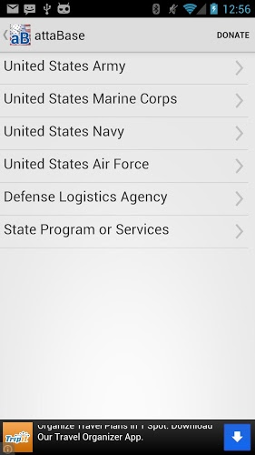
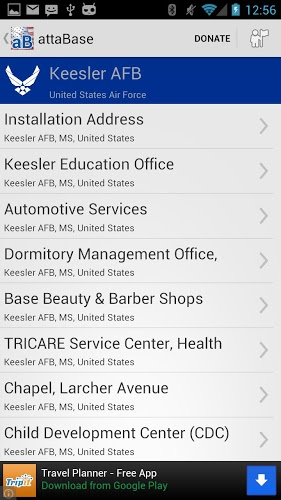
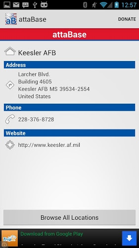
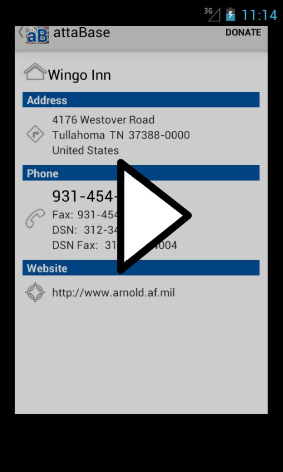

# 

Source code for attaBase, an Android DoD Base Directory

## attaBase Background
I worked on this project as an undergraduate at Brigham Young University. The purpose was simple: learn Android while creating something that might be useful. 

It is currently published on the Play store.

I decided to release the source code for this app to help other developers see how a simple Android app might look. This was the first app I ever wrote, and was an excellent project to learn how to code in Java and Android specifically.

Feel free to go through the source code and learn from the good and the bad. If you use parts of this code, please just give me attribution. 

## Download: [APK Release](release/attaBase.apk)

## Screenshots
||||
|---|---|---|
| *Service Listing*| *Base Resources*| *Base Details*|

### Video Walkthrough

## Google Play Description:
> AttaBase is a simple, straightforward directory app for Department of Defense military installations across the world. It uses data directly from the DoD and includes all bases for the US Army, US Navy, US Marine Corps (USMC), US Air Force (USAF), Defense Logistics Agency, and State Programs & Services (including Veteran Affairs, VA). 
> 
> AttaBase allows you to set a default base so all your base location details are available within seconds, including addresses, phone numbers (including fax and DSN), and web site addresses. You may also browse all published locations on US military bases around the world.

## Credits
This is solely the work of its author, [Bradford Law](bradford.la). 

## [License: MIT](LICENSE)

